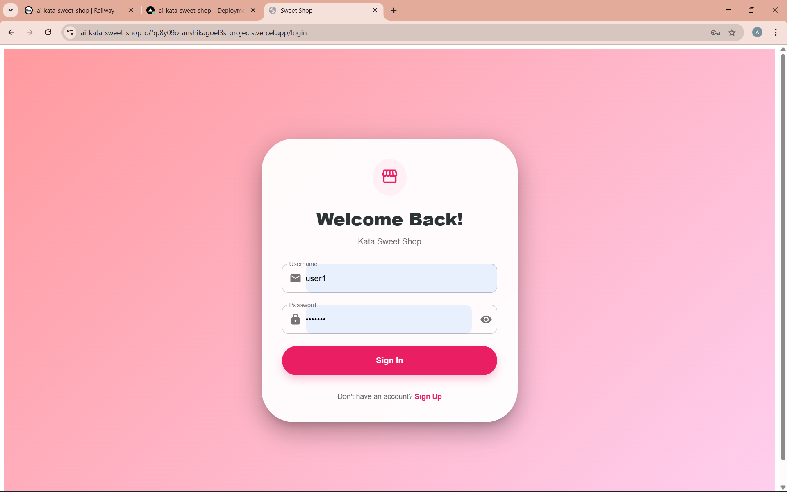
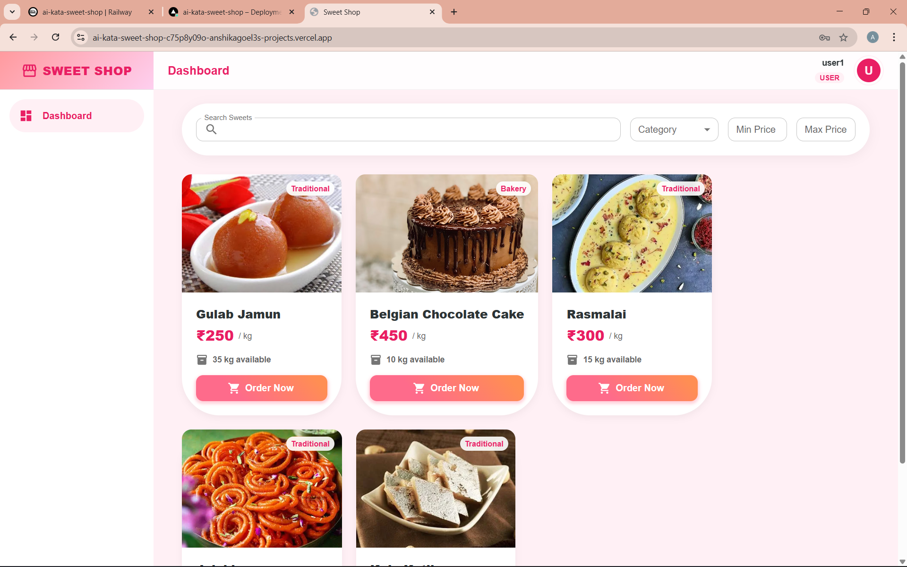

# 🍬 Sweet Shop Management System

A **full-stack Sweet Shop Management System** built as part of the **AI Kata – TDD Assessment**.  
This project demonstrates **backend API design**, **database integration**, **authentication**, **frontend UI development**, **testing practices**, **version control**, **deployment**, and **responsible AI usage**.

---

## 🔗 Live Application (Bonus)

-  **Frontend (Vercel):** [https://ai-kata-sweet-shop.vercel.app](https://ai-kata-sweet-shop.vercel.app)

- **Backend (Railway):**  
  https://ai-kata-sweet-shop-backend.up.railway.app

---

## 🧩 Project Structure

```

.
├── backend/        # Spring Boot REST API (SQLite + JWT)
├── frontend/       # React + Material UI SPA
└── README.md       # Project documentation

````

---

## 🖼️ Application Screenshots

### Login Screen


### User Dashboard (View & Purchase Sweets)


### Admin Dashboard (Manage Inventory)


### Add / Edit Sweet (Admin)


---

## 🤖 AI Usage Declaration (Mandatory)

As required by the assessment, below is a **transparent and accurate breakdown** of how AI tools were used during development.

### AI Tools Used
- **ChatGPT** – Backend logic, Java/Spring Boot architecture, and API design
- **Google Gemini** – Frontend development support, deployment guidance, and debugging

### How AI Was Used

1. **Backend Development (ChatGPT)**  
   - Generated initial Spring Boot boilerplate (controllers, services, repositories)
   - Assisted with API structure and authentication flow  
   - All **business logic**, **stock validation**, and **JWT security rules** were implemented and verified manually

2. **Frontend Development (Google Gemini)**  
   - Assisted in building and refining React components using Material UI  
   - Helped with UI structure, state handling, and API integration using Axios

3. **Deployment Support (Google Gemini)**  
   - Provided guidance for deploying the frontend on **Vercel**  
   - Assisted with backend deployment on **Railway**, including environment variable setup

4. **Debugging & Issue Resolution (Google Gemini)**  
   - Helped diagnose and resolve CORS issues between React and Spring Boot  
   - Assisted in debugging frontend API errors and deployment-related issues

### Reflection
AI tools significantly accelerated development by handling boilerplate, UI refinement, deployment setup, and debugging support.  
All AI-generated suggestions were **carefully reviewed, tested, and modified** to ensure correctness and compliance with assessment requirements.

---

## 🛠️ Tech Stack

### Backend
- Java 17
- Spring Boot 3
- SQLite (Persistent Database)
- Spring Security + JWT Authentication
- Maven

### Frontend
- React (Vite)
- Material UI (MUI)
- Axios

---

## 🧪 Testing Strategy

- **Backend:**  
  Core business logic developed using **TDD principles** (Red → Green → Refactor)

- **Frontend:**  
  UI-level validation for stock availability (e.g., disabling purchase when stock is zero)

---

## 📦 Running the Project Locally

### Backend

```bash
cd backend
mvn spring-boot:run
````

Server runs on:
`http://localhost:8080`

---

### Frontend

```bash
cd frontend
npm install
npm run dev
```

Client runs on:
`http://localhost:5173`

---

## 👤 Author

**Anshika Goel**


